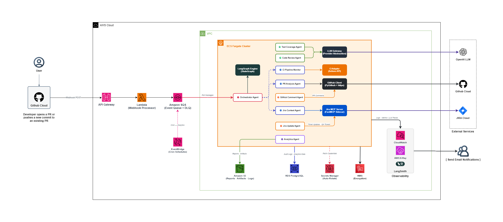
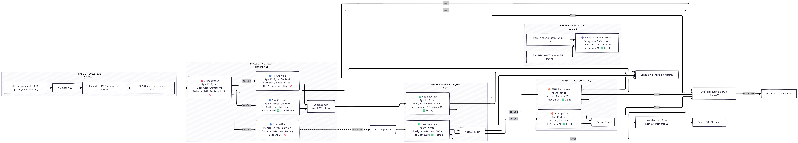

# maiCode — Intelligent Agentic Code Review System

## 1. Project Overview

maiCode is an enterprise-grade AI agentic system built for Nagarro that automates the entire code review lifecycle. It triggers automatically on GitHub Pull Requests, fetches associated Jira tickets via MCP, monitors CI pipelines, reviews code against ticket intent using AI, generates intelligent review comments, identifies missing test cases, updates Jira tickets with review status, and automatically creates QA test tickets. Post-merge, it tracks developer quality metrics to enable data-driven engineering management.

**Tech Stack:** Python 3.12 · LangGraph · LangChain · FastMCP · FastAPI · OpenAI GPT-4o · AWS (ECS Fargate, Lambda, SQS, RDS PostgreSQL, S3) · GitHub Actions · Jira Cloud

**Scale:** 10–150 developers · ~100 PRs/day · Multi-repository · Mixed programming languages

---

## 2. Architecture Overview

maiCode follows an **Event-Driven Architecture** with a **Supervisor-Worker agent pattern** built on LangGraph's StateGraph. The system uses 9 specialized AI agents coordinated by an Orchestrator through 3 parallel execution points, ensuring fast end-to-end review times of 2–5 minutes per PR.

**Architecture Style:** Event-driven microservices with asynchronous processing via SQS, containerized on ECS Fargate, with abstract LLM provider interfaces for flexibility.

### HLD Diagram




---

## 3. Application Flow



### Phase 1 — Ingestion (`< 500ms`)

| Step | Action |
|------|--------|
| 1 | GitHub sends webhook payload to API Gateway endpoint |
| 2 | Lambda validates webhook HMAC-SHA256 signature, parses event |
| 3 | Event published to SQS queue with priority attributes |
| 4 | Returns `202 Accepted` to GitHub immediately — processing is fully async from here |

```
GitHub Webhook (PR opened / synchronize / merged)
        │
        ▼
   API Gateway (HTTPS + WAF)
        │
        ▼
   Lambda (validate signature, parse)
        │
        ▼
   SQS Queue (pr-review-events)
```

### Phase 2 — Context Gathering (`5–30s` for PR/Jira · `up to 30min` for CI)

The Orchestrator Agent picks up the SQS message, initializes LangGraph state, and dispatches three Context Gatherer agents in parallel.

**⚡ Parallel Execution:**

| Agent | Role | Output |
|-------|------|--------|
| 🔵 PR Analysis Agent | Fetches PR diff, changed files, commit history from GitHub API. Detects PR pattern (feature/bugfix/refactor). | `state.pr_context` |
| 🔵 Jira Context Agent | Extracts ticket ID from branch name/commits. Fetches ticket details + acceptance criteria via MCP server. | `state.jira_context` |
| 🔵 CI Pipeline Monitor | Polls GitHub Actions for workflow runs. Waits for completion. Collects test results, coverage reports, build logs. | `state.ci_results` |

```
Orchestrator Agent (initialize state)
    │
    ├──── ⚡ PARALLEL FORK ────────────┐
    │                │                 │
    ▼                ▼                 ▼
PR Analysis    Jira Context      CI Pipeline
Agent          Agent             Monitor
    │                │                 │
    └───┬────────────┘                 │ (continues async)
        ▼                              │
   ⚡ PARALLEL JOIN                    ▼
   (PR + Jira ready)             (waits for CI)
```

### Phase 3 — Analysis (`30–90s`)

Code Review starts immediately after PR + Jira context is ready. Test Coverage waits for CI completion.

**⚡ Parallel Execution:**

| Agent | Role | Output |
|-------|------|--------|
| 🟢 Code Review Agent | 3-pass review: Intent Alignment → Code Quality → Risk Assessment. Language-aware rules. Severity-tagged findings per file/line. | `state.review_results` |
| 🟢 Test Coverage Agent | Cross-references changed files with test files. Analyzes coverage reports. Generates specific test case suggestions. | `state.coverage_results` |

```
    ⚡ PARALLEL
         │
   ┌─────┴──────┐
   ▼             ▼
Code Review   CI Monitor (waiting...)
Agent              │
   │               ▼ (CI completes)
   │          Test Coverage Agent
   │               │
   └──────┬────────┘
          ▼
    Analysis Join
```

### Phase 4 — Action (`5–15s`)

**⚡ Parallel Fork:**

| Agent | Role | Output |
|-------|------|--------|
| 🟠 GitHub Comment Agent | Posts/updates PR summary comment + inline code comments. Manages PR labels. Idempotent upsert via hidden HTML marker. | `state.action_results.github` |
| 🟠 Jira Update Agent | Adds review comment to ticket. Transitions ticket status. Creates QA test sub-tickets. Links related tickets. | `state.action_results.jira` |

```
    ⚡ PARALLEL FORK
         │
   ┌─────┴──────┐
   ▼             ▼
GitHub        Jira Update
Comment       Agent
Agent              │
   │               │
   └──────┬────────┘
          ▼
    ⚡ PARALLEL JOIN
          │
          ▼
   Workflow state persisted to PostgreSQL
   SQS message deleted
```

### Phase 5 — Analytics (Async · Daily)

**🟣 Analytics Agent** operates in two modes:

**Event-Driven (on PR merge):** Records merge event (timestamp, author, files changed, findings count, CI status, coverage delta). Opens 30-day monitoring window to track post-merge defects.

**Scheduled (daily at 02:00 UTC via EventBridge cron):** Computes per-developer quality scores — findings density, post-merge defect rate, coverage delta trends, CI pass rate on first push. Generates weekly/monthly reports to S3.

### Complete Pipeline Summary

```
GitHub Webhook
     │
     ▼
┌─────────────────────────────────────────────┐
│  PHASE 1: INGESTION  (< 500ms)             │
│  API Gateway → Lambda → SQS                │
└──────────────────┬──────────────────────────┘
                   │
                   ▼
┌─────────────────────────────────────────────┐
│  PHASE 2: CONTEXT GATHERING  (5–30s)       │
│  Orchestrator picks up SQS message          │
│                                             │
│  ⚡ PARALLEL:                               │
│  ├─ PR Analysis Agent    → state.pr_context │
│  ├─ Jira Context Agent   → state.jira_ctx   │
│  └─ CI Pipeline Monitor  → state.ci_results │
└──────────────────┬──────────────────────────┘
                   │
                   ▼
┌─────────────────────────────────────────────┐
│  PHASE 3: ANALYSIS  (30–90s)               │
│                                             │
│  ⚡ PARALLEL:                               │
│  ├─ Code Review Agent    → review_results   │
│  └─ Test Coverage Agent  → coverage_results │
└──────────────────┬──────────────────────────┘
                   │
                   ▼
┌─────────────────────────────────────────────┐
│  PHASE 4: ACTION  (5–15s)                  │
│                                             │
│  ⚡ PARALLEL:                               │
│  ├─ GitHub Comment Agent → PR comments      │
│  └─ Jira Update Agent   → Ticket updates   │
└──────────────────┬──────────────────────────┘
                   │
                   ▼
┌─────────────────────────────────────────────┐
│  PHASE 5: ANALYTICS  (Async)               │
│  Analytics Agent → Developer quality scores │
│  Post-merge defect tracking (30-day window) │
└─────────────────────────────────────────────┘
```

---

## 4. Agent Summary

### Quick Reference

| # | Agent | Type | Pattern | LLM Calls | Trigger |
|---|-------|------|---------|-----------|---------|
| 1 | Orchestrator Agent | Supervisor | Router / Deterministic | ❌ None | SQS message |
| 2 | PR Analysis Agent | Context Gatherer | Tool-Use (Sequential) | ❌ None | Orchestrator dispatch |
| 3 | Jira Context Agent | Context Gatherer | ReAct | ✅ Conditional | Orchestrator dispatch |
| 4 | CI Pipeline Monitor | Context Gatherer | Polling Loop + Tool-Use | ❌ None | Orchestrator dispatch |
| 5 | Code Review Agent | Analyzer | Chain-of-Thought (Multi-Pass) | ✅ Heavy (3 passes) | After PR + Jira ready |
| 6 | Test Coverage Agent | Analyzer | Chain-of-Thought + Tool-Use | ✅ Medium (1–2 calls) | After CI completes |
| 7 | GitHub Comment Agent | Actor | Tool-Use (Sequential) | ✅ Light (formatting) | After analysis complete |
| 8 | Jira Update Agent | Actor | ReAct | ✅ Light (formatting) | After analysis complete |
| 9 | Analytics Agent | Background | MapReduce + Structured Output | ✅ Light (summarization) | PR merge / Cron |

### Pattern Glossary

**Router / Deterministic** — Pure code logic with no LLM calls. Uses conditional branching to direct workflow. Fast, predictable, zero token cost. Used by the Orchestrator because every decision it makes is binary (did the agent succeed? have all parallel agents completed?).

**Tool-Use (Sequential)** — A fixed sequence of tool calls executed one after another. No LLM reasoning needed to decide what to do next. Used by PR Analysis Agent because the API call order is always the same — get PR, get diff, get files, get commits.

**ReAct (Reason + Act)** — LLM reasons about current state, decides which tool to call next, observes the result, then reasons again. Used by Jira Context Agent because it needs multi-strategy fallback logic (try branch name → try commit messages → try JQL search). Also used by Jira Update Agent because it needs runtime decisions about which transitions are valid.

**Chain-of-Thought (CoT)** — One or more LLM calls where the prompt asks the model to think step-by-step before producing a final answer. No tools during reasoning. Used by Code Review Agent for its 3-pass review because splitting analysis into focused passes (Intent → Quality → Risk) produces higher quality findings than a single monolithic prompt.

**Chain-of-Thought + Tool-Use** — Hybrid: tools gather data, then CoT reasoning analyzes it. Used by Test Coverage Agent — structural file mapping is deterministic (tool-use), but generating meaningful test case suggestions requires reasoning (CoT).

**Polling Loop** — Not an LLM pattern. Repeatedly calls an API at increasing intervals until a condition is met. Used by CI Pipeline Monitor to wait for GitHub Actions workflows to complete.

**MapReduce + Structured Output** — Processes many items by mapping a computation over each independently, then reducing into aggregates. LLM generates machine-parseable JSON output. Used by Analytics Agent to compute per-developer metrics across many PRs.

---

## 5. LangGraph State Flow

All agents communicate exclusively through a shared state object (TypedDict). Agents never call each other directly — this ensures loose coupling and independent testability.

### Graph Topology

| Graph Node | Connects To | Edge Type | State Written |
|------------|-------------|-----------|---------------|
| `START` | `orchestrator_init` | Direct | `event_metadata` |
| `orchestrator_init` | `pr_analysis` + `jira_context` | ⚡ Fan-out (parallel) | — |
| `pr_analysis` | `context_join` | Direct | `pr_context` |
| `jira_context` | `context_join` | Direct | `jira_context` |
| `context_join` | `code_review` + `ci_monitor` | ⚡ Fan-out (parallel) | — |
| `code_review` | `analysis_join` | Direct | `review_results` |
| `ci_monitor` → `test_coverage` | `analysis_join` | Sequential | `ci_results`, `coverage_results` |
| `analysis_join` | `github_comment` + `jira_update` | ⚡ Fan-out (parallel) | — |
| `github_comment` | `action_join` | Direct | `action_results.github` |
| `jira_update` | `action_join` | Direct | `action_results.jira` |
| `action_join` | `orchestrator_finalize` → `END` | Direct | `workflow_status` |
| `any_node (error)` | `error_handler` → retry / END | Conditional | `errors[]` |

### State Schema

| State Field | Type | Written By | Read By |
|-------------|------|------------|---------|
| `event_metadata` | EventMeta | Orchestrator | All agents |
| `pr_context` | PRContext | PR Analysis Agent | Code Review, Test Coverage, Comment |
| `jira_context` | JiraContext \| None | Jira Context Agent | Code Review, Jira Update |
| `ci_results` | CIResults \| None | CI Pipeline Monitor | Test Coverage, Comment, Jira Update |
| `review_results` | ReviewFindings | Code Review Agent | Comment, Jira Update |
| `coverage_results` | CoverageReport | Test Coverage Agent | Comment, Jira Update |
| `action_results` | ActionLog | Comment + Jira Agents | Orchestrator |
| `errors` | list[AgentError] | Any agent (on failure) | Orchestrator (retry logic) |
| `workflow_status` | enum | Orchestrator | All agents |

---

## 6. Technology Stack

| Layer | Technology | Notes |
|-------|-----------|-------|
| Language | Python 3.12+ | async/await, type hints |
| Agent Framework | LangGraph + LangChain | StateGraph for workflow orchestration |
| MCP Framework | FastMCP | Jira MCP server implementation |
| LLM | OpenAI GPT-4o | Abstract interface allows provider switch |
| Web Framework | FastAPI | Admin dashboard API, health checks |
| GitHub Client | PyGithub + httpx | REST v3 + GraphQL v4 |
| Database | PostgreSQL 16 (RDS) | Via SQLAlchemy + Alembic migrations |
| Queue | Amazon SQS | Event queue + DLQ |
| Object Storage | Amazon S3 | Reports, artifacts, LLM audit logs |
| Compute | ECS Fargate | Serverless containers, auto-scaling 2–20 tasks |
| Webhook Processor | AWS Lambda | Stateless, <500ms response |
| Secrets | AWS Secrets Manager | Auto-rotation |
| Scheduler | Amazon EventBridge | Cron for daily analytics |
| IaC | Terraform | Modular, state per layer |
| Containers | Docker | Multi-stage builds |
| Observability | CloudWatch + LangSmith | Logs, metrics, LLM traces |
| Testing | pytest + pytest-asyncio | Unit + integration tests |
| Linting | Ruff + mypy | Enforced in CI |

---

## 7. Key Design Decisions

**Why SQS between Lambda and ECS?** GitHub expects a webhook response within 10 seconds, but the review pipeline takes 2–5 minutes. SQS decouples ingestion speed from processing speed — Lambda responds in <500ms and queues the work. SQS also provides automatic retry (visibility timeout), burst absorption (peak hour PR floods), and dead letter queue for failed processing without writing any retry logic.

**Why LangGraph over direct API calls?** The workflow has 3 parallel fork/join points, conditional routing, error recovery with retry policies, and shared state across 9 agents. LangGraph's StateGraph provides all of this declaratively — parallel fan-out/fan-in, conditional edges, and a typed shared state object. Building this from scratch with raw asyncio would require reimplementing what LangGraph already provides.

**Why MCP for Jira instead of direct REST?** MCP provides a structured tool interface that LLM agents can invoke naturally. The Jira Context Agent and Jira Update Agent use ReAct pattern — they reason about which MCP tool to call next based on runtime state. MCP's tool discovery means adding new Jira operations doesn't require agent code changes, just new tool definitions on the server.

**Why abstract LLM provider interface?** OpenAI is the current provider, but costs, rate limits, or policy changes could require a switch. The LLM Gateway implements an abstract `LLMProvider` base class with `generate()`, `stream()`, and `embed()` methods. Switching to Anthropic or Azure OpenAI means adding a new provider implementation and changing a config value — zero agent code changes.

**Why ECS Fargate over Lambda for agents?** Lambda has a 15-minute max timeout. The CI Pipeline Monitor alone can wait up to 30 minutes for workflows to complete. ECS Fargate tasks have no timeout ceiling, support long-running processes, avoid cold start issues, and allow sidecar containers (Jira MCP server runs as a sidecar in the same task definition).

**Author**
- Abhinav Singh (abhinav.singh04@nagarro.com)

**Co-Authors**
- Mayank Singh (mayank.singh01@nagarro.com)
- Avinash Yadav (avinash.yadav@nagarro.com)